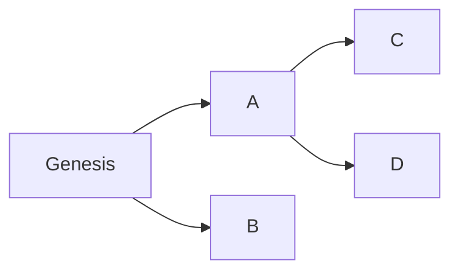
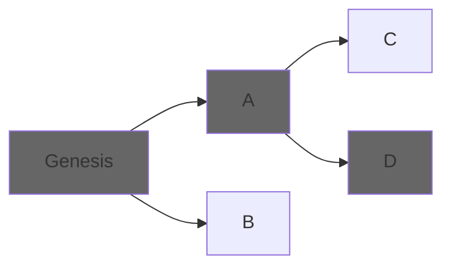
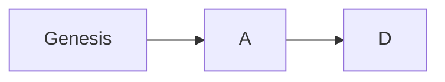
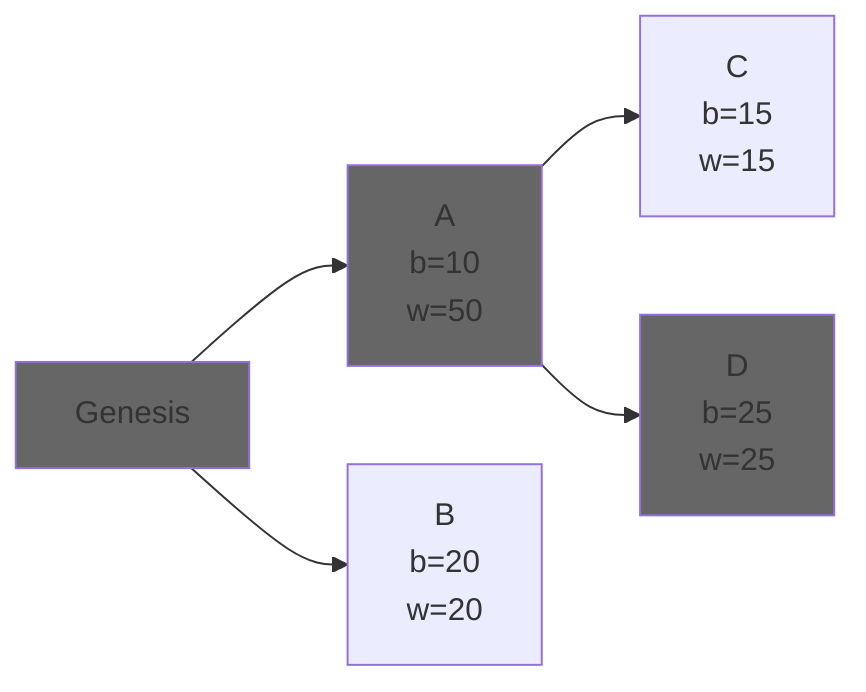

# Lambda_Ethereum_Consensus

[](https://t.me/lambdaconsensus)

## Why Elixir?

Elixir is a functional programming language that runs atop the Erlang Virtual Machine (BEAM). It offers enhanced readability, syntactic sugar, and reduced boilerplate, enabling developers to achieve more with fewer lines of code compared to Erlang. Like Erlang, Elixir compiles to bytecode that is interpreted by the VM. As a result, it inherits several notable properties, including:

- Fault tolerance for increased reliability
- High availability
- Simplified construction of complex distributed systems
- Predictable latency

[Erlang](https://www.erlang.org/) and its VM were originally developed in 1986 for telecommunication systems that demanded unparalleled uptime and reliability. We recognize that these attributes could be immensely beneficial for an Ethereum client, particularly in the realm of consensus. This is why our current focus is on building a consensus layer (CL) rather than an execution layer (EL). Elixir may not be tailored for sheer performance, but it excels in delivering predictable latency and creating systems designed for continuous operation—qualities essential for the CL.

Our aim is to infuse these strengths into the Ethereum consensus client ecosystem with our offering.

We also have for objective to bootstart an Ethereum Elixir community, and to make Elixir a first-class citizen in the Ethereum ecosystem.

## Contributor Package

Dream of becoming an Ethereum core developer? Eager to shape the protocol that will underpin tomorrow's world? Want to collaborate with a passionate team, learn, grow, and be a pivotal part of the Ethereum Elixir community?

**Then you're in the right place! 🚀**

### Getting Started:

#### 1. **Installation**:

- **Prerequisites**: Before diving in, ensure you have the necessary tools installed. Check out the [Prerequisites](#prerequisites) section for guidance.
  
- **Clone the Repository**:

  ```shell
  git clone [REPO_URL]
  cd lambda-ethereum-consensus
  ```

- **Setup**: Once you've cloned the repository, follow the steps in the [Installing and running](#installing-and-running) section to set up your environment.

#### 2. **Prerequisite Knowledge**:

To contribute effectively, you'll need a foundational understanding of both the Ethereum protocol and the Elixir language, including the Erlang VM (BEAM). If you're new to these areas, we've curated a list of resources to get you started:

**Learning Elixir**:

- **Books**:
  - [Elixir in Action](https://www.manning.com/books/elixir-in-action-third-edition)
  - [Learn You Some Erlang](https://learnyousomeerlang.com/)
- **Videos**:
  - [Intro to Elixir](https://youtube.com/playlist?list=PLJbE2Yu2zumA-p21bEQB6nsYABAO-HtF2)
  - [Hitchhiker's tour of the BEAM](https://www.youtube.com/watch?v=_Pwlvy3zz9M)
- **Blogs**:
  - [Zen of Erlang](https://ferd.ca/the-zen-of-erlang.html)
  - [Where Erlang Blooms](https://ferd.ca/rtb-where-erlang-blooms.html)
  - [What can I only do in Erlang](https://hackmd.io/ZpUazPomRvacKoyW2vq54g)
  - [Stacking theory for systems design](https://medium.com/@jlouis666/stacking-theory-for-systems-design-2450e6300689)
  - [On Erlang States and Crashes](http://jlouisramblings.blogspot.com/2010/11/on-erlang-state-and-crashes.html)
  - [How Erlang does scheduling](http://jlouisramblings.blogspot.com/2013/01/how-erlang-does-scheduling.html)

With this foundation you should have a basic understanding of the Elixir language and the Erlang VM. You can then start (or in parallel) learning about the Ethereum protocol.

**Learning Ethereum**:

- **Books**:
  - [Eth2Book by Ben Edgington](https://eth2book.info)
  - [Inevitable Ethereum](https://inevitableeth.com/site/content)
- **Papers**:
  - [Ethereum Whitepaper](https://ethereum.org/en/whitepaper/)
  - [Ethereum Yellowpaper](https://ethereum.github.io/yellowpaper/paper.pdf)
    - [Yellow paper discussion](youtube.com/watch?v=e84v1mxrlys)
    - [Yellow paper walkthrough](https://www.lucassaldanha.com/ethereum-yellow-paper-walkthrough-1/)
  - [Ethereum Beige Paper](https://github.com/chronaeon/beigepaper/blob/master/beigepaper.pdf)
  - [Ethereum Mauve Paper](https://cdn.hackaday.io/files/10879465447136/Mauve%20Paper%20Vitalik.pdf)
- **Videos**:
  - [Basic technical details of Ethereum](https://youtu.be/gjwr-7PgpN8)
  - [Ethereum in 30 minutes](https://youtu.be/UihMqcj-cqc)
  - [Ethereum Foundation youtube channel](https://www.youtube.com/@EthereumFoundation)
  - [Ethereum youtube channel](https://www.youtube.com/@EthereumProtocol)
- **Blogs**:
  - [Vitalik Buterin's blog](https://vitalik.ca/)
  - [Ethereum Foundation blog](https://blog.ethereum.org/)
  - [Ethereum Magicians forum](https://ethereum-magicians.org/)
  - [Ethresear.ch forum](https://ethresear.ch/)
  - [EIP's](https://eips.ethereum.org/)
  - [ACD & Related meetings](https://github.com/ethereum/pm)
- **Specifications**:
  - [Consensus specs](https://github.com/ethereum/consensus-specs)
  - [Vitalik Buterin's annotated specs](https://github.com/ethereum/annotated-spec)
  - [Eth2Book annotated specs](https://eth2book.info/capella/part3/)

While some of the resources listed might appear outdated, it's important to understand that the Ethereum protocol is continuously evolving. As such, there isn't a definitive, unchanging source of information. However, these resources, even if older, provide foundational knowledge that remains pertinent to understanding the protocol's core concepts.

Truly mastering the Ethereum protocol is a complex endeavor. The list provided here is just a starting point, and delving deeper will necessitate exploring a broader range of readings and resources. As you immerse yourself in the project, continuous learning and adaptation will be key.

If you come across any resource that you find invaluable and believe should be added to this list, please don't hesitate to suggest its inclusion.

#### 3. **Dive In**:

With your newfound knowledge, explore the various areas of our project. Whether you're interested in the core consensus layer, networking, CLI, documentation, testing, or tooling, there's a place for you.

Start by browsing our [issues](https://github.com/lambdaclass/lambda_ethereum_consensus/issues), especially those tagged as `good first issue`. These are beginner-friendly and a great way to familiarize yourself with our codebase.

### Contributing:

Found an issue you're passionate about? Comment with `"I'd like to tackle this!"` to claim it. Once assigned, you can begin your work. After completing your contribution, submit a pull request for review. Our team and other contributors will be able to provide feedback, and once approved, your contribution will be merged.

Please adhere to the [Conventional Commits](https://www.conventionalcommits.org/en/v1.0.0/) specification when crafting commit messages.

### Communication:

**For specific questions** related to issues, you can use the chat provided under each issue.

**For general questions**, discussions, and feedback, you can use the [Lambda Consensus Client](https://t.me/lambdaconsensus) telegram group.

**Together, let's shape the future of Ethereum! 🚀**

## Prerequisites

### Direct Installation

You can install the necessary components directly from official sources:

- [Elixir](https://elixir-lang.org/install.html)
- [Erlang](https://www.erlang.org/downloads)
- [Go](https://go.dev/doc/install)
- [Rust](https://www.rust-lang.org/tools/install)

### Alternative (Recommended) Installation

For precise control over versions, it's recommended to use the **asdf** tool version manager and follow the versions specified in `.tool-versions` in this repository.

- [asdf tool version manager](https://asdf-vm.com/guide/getting-started.html)

After installing **asdf**, add the required plugins for managing the tools:

```shell
asdf plugin add elixir
asdf plugin add erlang
asdf plugin add golang
asdf plugin add rust
```

Finally, install the specific versions of these tools as specified in `.tool-versions`:

```shell
asdf install
```

## Installing and running

There are Makefile targets for these tasks.

```shell
make deps # Installs dependencies
make iex  # Runs a terminal with the application started
make test # Runs tests
```

The iex terminal can be closed by pressing ctrl+c two times.

## Research 

In this section we will document our research on the different topics related to the development of the Lambda Consensus Client. This will include: Ethereum general research, Ethereum Consensus Layer research, Elixir research, Erlang research, Architecture research and more.

### Elixir & Architechture Research

#### Elixir ↔ Go bindings

##### Introduction

The bindings are used to interact with the *go-libp2p* and *go-ethereum/p2p* libraries, in charge of peer-to-peer communication and discovery.
As we couldn't find a way to communicate the two languages directly, we used some **C** code to communicate the two sides.
However, as Go is a garbage-collected language, this brings some issues.

<!-- TODO: add explanation about general bindings usage -->
<!-- TODO: explain the callback -> message translation -->

##### References and handles

To manage memory, the Golang runtime tracks references (pointers) to find which objects are no longer used (more on this [here](https://tip.golang.org/doc/gc-guide)).
When those references are given to functions outside the Golang runtime (i.e. returned as a call result), they stop being valid (explained [here](https://pkg.go.dev/cmd/cgo#hdr-Passing_pointers)).
To bypass this restriction, we use [*handles*](https://pkg.go.dev/runtime/cgo).
Basically, they allow the reference to "live on" until we manually delete it.

This would allow us to pass references from Go to C and back:

```go
import "runtime/cgo"

// This comment exports the function
//export CreateArrayWithNumbers
func CreateArrayWithNumbers() C.uintptr_t {
    // This function is called from C
    var array []int
    for i := 0; i < 8; i++ {
        array = append(array, i)
    }
    // We create a handle for the array
    handle := cgo.NewHandle(array)
    // We turn it into a number before returning it to C
    return C.uintptr_t(handle)
}

//export SumAndConsumeArray
func SumAndConsumeArray(arrayHandle C.uintptr_t) uint {
    // We transform the number back to a handle
    handle := cgo.Handle(arrayHandle)
    // We retrieve the handle's contents
    array := handle.Value().([]int)
    // We use the array...
    var acc int
    for _, n := range array {
        acc = acc + n
    }
    // As we don't need the array anymore, we delete the handle to it
    handle.Delete()
    // After
    return acc
}
```


#### Resources and destructors

What we have until now allows us to create long-living references, but we still need to free them manually (otherwise we leak memory).
To fix this, we can treat them as native objects with Erlang's [*Resource objects*](https://www.erlang.org/doc/man/erl_nif.html#functionality).
By treating them as resources with an associated type and destructor, we can let Erlang's garbage-collector manage the reference's lifetime.
It works as follows:

<!-- TODO: add code examples -->

1. we declare a new resource type with [`enif_open_resource_type`](https://www.erlang.org/doc/man/erl_nif.html#enif_open_resource_type) when the NIF is loaded, passing its associated destructor
1. we create a new resource of that type with [`enif_alloc_resource`](https://www.erlang.org/doc/man/erl_nif#enif_alloc_resource)
1. we move that resource into an *environment* (i.e. the Erlang process that called the NIF) with [`enif_make_resource`](https://www.erlang.org/doc/man/erl_nif#enif_make_resource)
1. we release our local reference to that resource with [`enif_release_resource`](https://www.erlang.org/doc/man/erl_nif#enif_release_resource)
1. once all Elixir-side variables that reference the resource are out of scope, Erlang's garbage collector calls the destructor associated with the type

Note that we use a different resource type for each Go type. This allows us to differentiate between them, and return an error when an unexpected one is received.

#### Simple SerialiZe NIF implementation

##### Adding a new type

In order to add a new SSZ container to the repo, we need to modify the NIF. Here's the how-to:

*Note that you can start from whichever side you are most comfortable with.*

Rust side (`native/ssz_nif`):

1. Look for the struct definition in the *[lighthouse_types](https://github.com/sigp/lighthouse/tree/stable/consensus/types)* crate (it should have the same name as in the [spec](https://github.com/ethereum/consensus-specs/tree/dev)).
2. Add the struct definition to the corresponding module under `native/ssz_nif/src/types`, surrounding it with `gen_struct` and adding the `#[derive(NifStruct)]` and `#[module …]` attributes (you can look at `beacon_chain.rs` for examples).
3. If the lighthouse struct uses generics, you’ll have to alias it in `native/ssz_nif/src/lh_types.rs`, and use that same name for your struct.
4. Translate the types used (`Epoch`, `[u64; 32]`, etc.) to ones that implement *rustler* traits (you can look at [this cheat sheet](https://rustler-web.onrender.com/docs/cheat-sheet), or at the already implemented containers). These types should be equivalent to the ones used in [the official spec](https://github.com/ethereum/consensus-specs/tree/dev).
5. If it fails because `FromElx` or `FromLH` are not implemented for types X and Y, add those implementations in `utils/from_elx.rs` and `utils/from_lh.rs` respectively.
6. Add the type name to the list in `to_ssz` and `from_ssz`.
7. Check that it compiles correctly.

Elixir side:

1. Add a new file and module with the container's name under `lib/ssz_types`. The module should be prefixed with `SszTypes.` (you can use an existing one as a template).
2. Add the struct definition and `t` type. You should try to mimic types used in the official spec, like those in `lib/ssz_types/mod.ex` (feel free to add any that are missing).
3. Add the implemented struct's name to the `@enabled` list in the `SSZStaticTestRunner` module (file `test/spec/runners/ssz_static.ex`).
4. Check that spec-tests pass, running `make spec-test`. For this, you should have all the project dependencies installed (this is explained in the main readme).


### Ethereum Research

#### Consensus basics

##### Classic consensus

As a distributed state machine, the EVM takes some elements from classic consensus algorithms, such as [Raft](https://raft.github.io/):

- Users of the network send commands (transactions) to change the state of the EVM.
- Nodes propagate those transactions.
- A leader is elected and proposes a transaction to be the next one to be applied.
- As there's a single leader, each node will receive that transaction and add it to its local copy of the transaction history.
- Mechanisms are put in place so that nodes make sure that they have the same order of transactions and applying them to their local state machines is safe.

Algorithms like Raft assume a setup where nodes are known, running the same software, well intentioned, and the only problems arise from network/connectivity issues, which are inherent to any distributed system. They prioritize safety and require 50% of the network plus one node to be live in order to be available.

##### Bizantine consensus

Blockchains like Ethereum work in a bizantine environment, where anyone can join the network running a software that may be different, due to bugs or intentionally. This means there are several fundamental differences:

- Cryptographic signatures are introduced to validate authority of transactions.
- Transactions are batched into blocks, so that the consensus overhead is reduced.
- Verifying the integrity of blocks needs to be easy. For this reason each block is linked to its parent, each block has a hash of its own contents, and part of each block's content is its parent hash. That means that changing any block in history will cause noticeable changes in the block's hash.
- Leaders are not elected by a simple majority, but by algorithms such as proof of work or proof of stake, that introduce economic incentives so that participating in consensus is not cost-free and chances of spamming the protocol are reduced. They are only elected for a single block and the algorithm is repeated for the next one.

##### Forks

In Ethereum, liveness is prioritized over safety, by allowing forks: different versions of history can be live at the same time. Due to networking delays (e.g. block production being faster than propagation) or client differences, a client may receive two different blocks at the same time as the next one.



This means that instead of a block chain we get a block tree, were each branch is called a "fork". Consensus, in this context, means nodes need to chose the same forks as the canonical chain, so that they share the same history. The criteria to chose from a particular fork is called "Fork-choice algorithm".



Genesis will always be chosen as it will be the first block in any chain. Afterwards, if blocks A and D are chose by the algorithm, that means the canonical chain will now be:



##### Ethereum consensus algorithms

In post-merge Ethereum, consensus is reached by two combined fork-related algorithms:

- LMD GHOST: a fork-choice algorithm based on votes (attestations). If a majority of nodes follow this algorithm, they will tend to converge to the same canonical chain. We expand more on it on [this document](fork_choice.md).
- Casper FFG: provides some level of safety by defining a finalization criterion. It takes a fork tree and defines a strategy to prune it (make branches inaccessible). Once a block is tagged as "final", blocks that aren't either parents (which are also final) or decendents of it, are not valid blocks. This prevents long reorganizations, which might make users vulnerable to double spends. We expand on it in [this document](finality.md).

##### Attestation messages

A single vote emitted by a validator consists of the following information:

- slot at which the attestation is being emmited.
- index: index of the validator within the comittee.
- beacon block root: the actual vote. This identifies a block by the merkle root of its beacon state.
- source: checkpoint
- target: checkpoint

This messages are propagated either directly (attestation gossip) or indirectly (contained in blocks).

#### Fork-choice: LMD GHOST

Let's separate the two parts of the name.

- GHOST: **G**reediest, **H**eaviest-**O**bserved **S**ub-**T**ree. The algorithm provides a strategy to choose between two forks/branches. Each branch points to a block, and each block can be thought of as the root of a subtree containing all of its child nodes. The weight of the subtree is the sum of the weights of all blocks in it. The weight of each individual block is obtained from the attestations on them.
- LMD: each validator gives attestations/votes to the block they think is the current head of the chain (Message Driven). "Latest" means that only the last attestation for each validator will be taken into account.

By choosing a fork, each node has a single, linear chain of blocks that it considers canonical. The last child of that chain is called the chain's "head".

##### Reacting to an attestation

When an attestation arrives, the `on_attestation` callback must:

1. Perform the [validity checks](https://eth2book.info/capella/part3/forkchoice/phase0/#validate_on_attestation). tl;dr: the slot and epoch need to be right, the vote must be for a block we have, validate the signature and check it doesn't conflict with a different attestation by the same validator.
2. [Save the attestation](https://eth2book.info/capella/part3/forkchoice/phase0/#update_latest_messages) as that validator's latest message. If there's one already, update the value.

##### Choosing forks

We now have a store of each validator's latest vote, which allows LMD GHOST to work as a `get_head(store) -> Block` function.

We first need to calculate each block's weight:

- For leaf blocks, we calculate their weight by checking how many votes they have.
- For each branch block we calculate its weight as the sum of the weight of every child, plus its own votes. We repeat this until we reach the root, which will be the last finalized block (there won't be any branches before, so there won't be any more fork-choice to perform).

This way we calculate the weight not only for each block, but for the subtree where that block is the root.

Afterwards, when we want to determine which is the head of the chain, we traverse the tree, starting from the root, and greedily (without looking further ahead) we go block by block chosing the sub-tree with the highest weight.

Let's look at an example:



Here, individual block weights are represented by "b", while subtree weights are represented by "w". Some observations:

- $W = B$ for all leaf blocks, as leafs are their own whole subtree.
- $W_A=W_C+W_B +B_A= B_B + B_C + B_A$
- While the individual weight of $A$ is smaller than $B$, its children make the $A$ subtree heavier than the $B$ subtree, so its chosen by LMD GHOST over $B$.

In general:

$$W_N = B_N + \sum_i^{i \in \text{children}[N]}W_i$$

##### Slashing

In the previous scheme, there are two rewards:

- Proposer rewards, given to a proposer when their block is included in the chain. This also adds an incentive for them to try to predict the most-likely branch to be the canonical one.
- Attester rewards, which are smaller. These are given if the blocks they attest to are included.

These incentives, however, are not enough. To maximize their likelihood of getting rewards, they may misbehave:

- Proposers may propose a block for every current fork.
- Attesters may attest to every current head in their local chains.

These misbehaviors debilitate the protocol (they give weight to all forks) and no honest node running fork-choice would take part on them. To prevent them, nodes that are detected while doing them are slashed (punished), which means that they are excluded from the validator set and a portion of their stake is burned.

Nodes provide proofs of the offenses, and proposers including them in blocks get whistleblower rewards. Proofs are:

- For proposer slashing: two block headers in the same slot signed by the same signature.
- For attester slashing: two attestations signed in the same slot by the same signature.

##### Guarantees

- Majority honest progress: if the network has over 50% nodes running this algorithm honestly, the chain progresses and each older block is exponentially more unlikely to be reverted.
- Stability: fork-choice is self-reinforcing and acts as a good predictor of the next block.
- Manipulation resistence. Not only is it hard to build a secret chain and propose it, but it prevents getting attestations for it, so the current canonical one is always more likely to be heavier. This holds even if the length of the secret chain is higher.

#### Finalization: Casper FFG

The name stands for Friendly Finality Gadget. It as a "finality gadget" as it always works on top of a block-proposing algorithm.

**This document will be expaned in a different PR**

## Code of Conduct

### Our Pledge

We, as members, contributors, and leaders of open source communities and projects pledge to make participation in our community a harassment-free experience for everyone, regardless of age, body size, visible or invisible disability, ethnicity, sex characteristics, gender identity and expression, level of experience, education, socio-economic status, nationality, personal appearance, race, religion, or sexual identity and orientation.

We pledge to act and interact in ways that contribute to an open, welcoming, diverse, inclusive, and healthy community and project.

### Our Standards

Examples of behavior that contributes to a positive environment for our community include:

- Demonstrating empathy and kindness toward other people.
- Being respectful of differing opinions, viewpoints, and experiences.
- Giving and gracefully accepting constructive feedback.
- Accepting responsibility and apologizing to those affected by our mistakes, and learning from the experience.
- Focusing on what is best not just for us as individuals, but for the overall community and project.

Examples of unacceptable behavior include:

- The use of sexualized language or imagery, and sexual attention or advances of any kind.
- Trolling, insulting or derogatory comments, and personal or political attacks.
- Public or private harassment.
- Publishing others' private information, such as a physical or electronic address, without their explicit permission.
- Other conduct which could reasonably be considered inappropriate in a professional setting.

## Enforcement Responsibilities

Maintainers are responsible for clarifying and enforcing standards of acceptable behavior and will take appropriate and fair corrective action.

Project maintainers have the right and responsibility to remove, edit, or reject comments, commits, code, wiki edits, issues, and other contributions that are not aligned to this Code of Conduct, or to ban temporarily or permanently any contributor for behaviors that they deem inappropriate, threatening, offensive, or harmful.

## Enforcement

Instances of abusive, harassing, or otherwise unacceptable behavior may be reported with proof to the maintainers through Telegram. All complaints will be reviewed and investigated promptly, fairly and anonymously.

## Attribution

This Code of Conduct is adapted from the [Contributor Covenant](https://www.contributor-covenant.org/version/2/1/code_of_conduct.html), version 2.1.