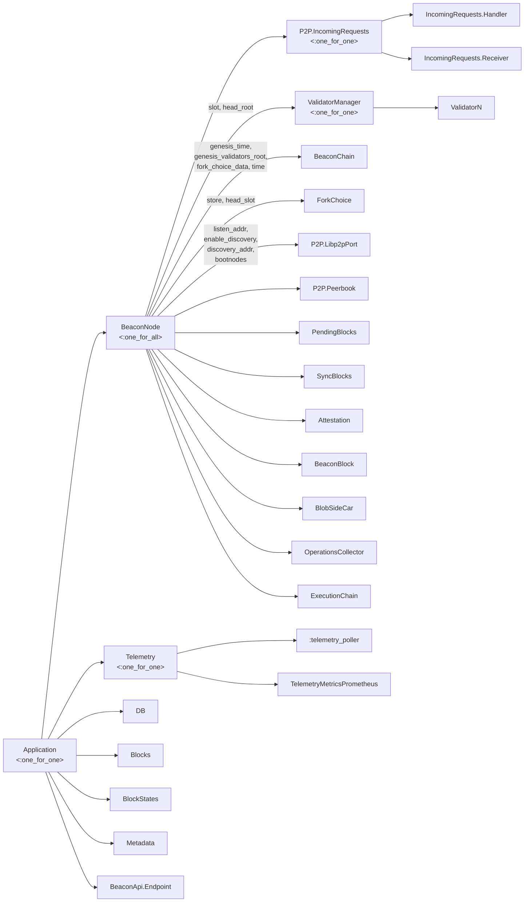
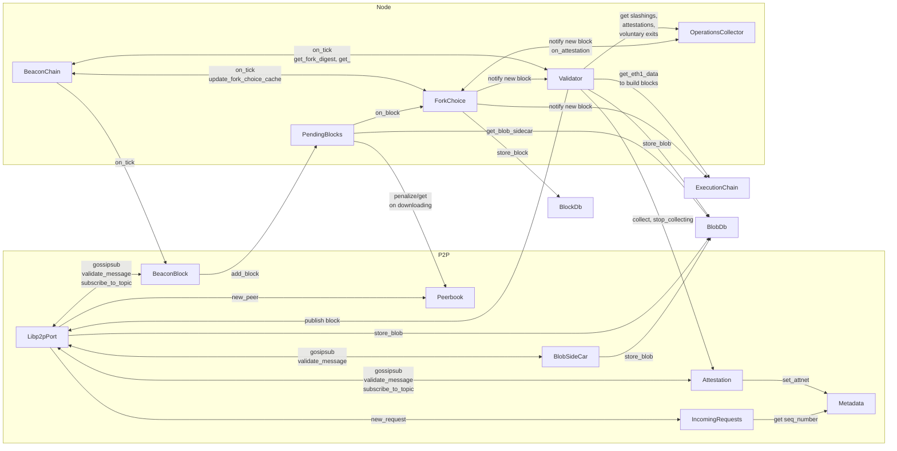
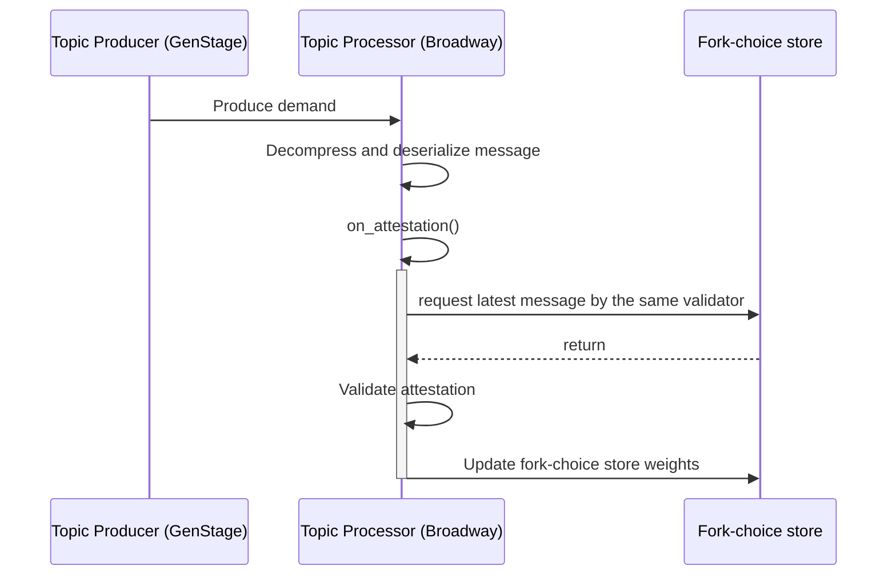
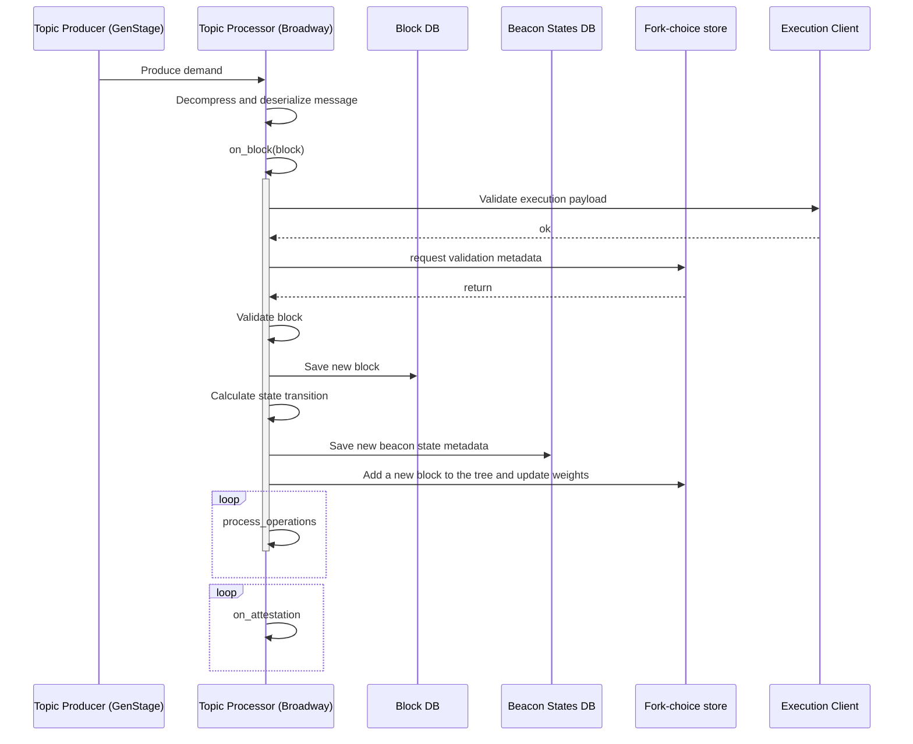

# Architecture of the consensus node

## Processes

This is our complete supervision tree.

Each box is a process. If it has children, it's a supervisor, with it's restart strategy clarified. 

If it's a leaf in the tree, it's a GenServer, task, or other non-supervisor process. The tags in the edges/arrows are the init args passed on children init (start or restart after crash).

## Block diagram

This is the high level interaction between the processes.

## Networking

The main entry for new events is the gossip protocol, which is how our consensus node communicates with other consensus nodes. This includes:

1. Discovery: our node has a series of known `bootnodes` hardcoded. We request a list of the nodes they know about and add them to our list. We save them locally and now can use those too to request new nodes.
2. Message propagation. When a proposer sends a new block, or validators attest for a new block, they send those to other known nodes. Those, in turn, propagate the messages sent to other nodes. This process is repeated until, ideally, the whole network receives the messages.

We use the `go-libp2p` library for the networking primitives, which is an implementation of the `libp2p` networking stack.

We use ports to communicate with a go application and Broadway to process notifications.

**TO DO**: We need to document the port's architecture.

## Gossipsub

One of the main communication protocols is GossipSub. This allows us to tell peers which topics we're interested in and receive events for them. The main external events we react to are blocks and attestations.

### Receiving an attestation

When receiving an attestation, it's processed by the [on_attestation](https://eth2book.info/capella/annotated-spec/#on_attestation) callback. We just validate it and send it to the fork choice store to update its weights and target checkpoints. The attestation is only processed if this attestation is the latest message by that validator. If there's a newer one, it should be discarded.

The most relevant piece of the spec here is the [get_weight](https://eth2book.info/capella/annotated-spec/#get_weight) function, which is the core of the fork-choice algorithm. In the specs, this function is called on demand, when calling [get_head](https://eth2book.info/capella/annotated-spec/#get_head), works with the store's values, and recalculates them each time. In our case, we cache the weights and the head root each time we add a block or attestation, so we don't need to do the same calculations again. 

**To do**: we should probably save the latest messages in persistent storage as well so that if the node crashes we can recover the tree weights.

### Receiving a block

Receiving a block is more complex:

- The block itself needs to be stored.
- The state transition needs to be applied, a new beacon state calculated, and stored separately.
- A new node needs to be added to the block tree aside from updating weights.
- on_attestation needs to be called for each attestation.

Also, there's a more complex case: we can only include a block in the fork tree if we know of its parents and their connection with our current finalized checkpoint. If we receive a disconnected node, we'll need to use Request-Response to ask peers for the missing blocks.

## Request-Response

**TO DO**: document how ports work for this.

### Pending blocks

**TO DO**: document pending blocks design.

### Checkpoint sync

**TO DO**: document checkpoint sync.

## Next document

Let's go over [Fork Choice](fork_choice.md) to see a theoretical explanation of LMD GHOST.
