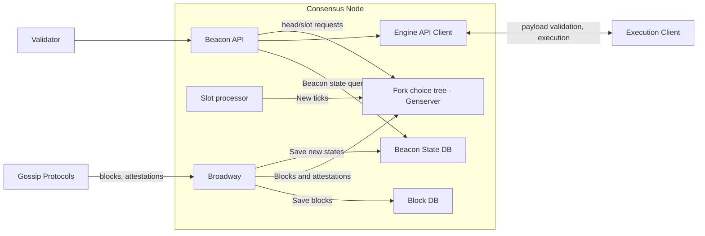
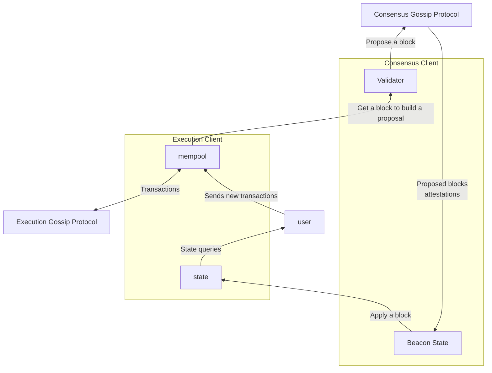

# Architecture

This is a block diagram of all the parts of the system and will be updated as needed.

## Using ethereum

As we talked previously, Ethereum is a network made by different computers. Its workflow would work, in theory, as follows:

- A user of the network sends a transaction (e.g. an eth transfer) to the network.
- The network validates the transaction.
- The network includes the transaction in a block.
- The network includes the block in the chain, so the new state includes the transaction sent by the user. Any user can request this information and the change will be reflected.

The problem here is: what does sending something to the network mean?

## How does this actually work? Who talks with who?

Ideally, each user has its own node installed in their computer and they interact with the network by sending their transactions and queries to their own node. This node propagates the message to other nodes and receives propagated messages from its peers to update its own view of the EVM state. When the user queries some state, the node answers with its own view.

A full node in two parts:

- **The execution client** knows how to represent EVM state and apply state changes (transactions) to generate new states. It represents the state machine. When you send eth to a different user, you send a transaction represetning this to your local execution client. The execution client propagates your transaction to other execution clients in the execution gossip network.
- **The consensus client** knows very little about the state machine, but knows how to choose between different worldviews and agree with other nodes. It enable the execution client to apply the correct state transitions.

Here's a block diagram of their interactions:

Assuming you're a full participant 
