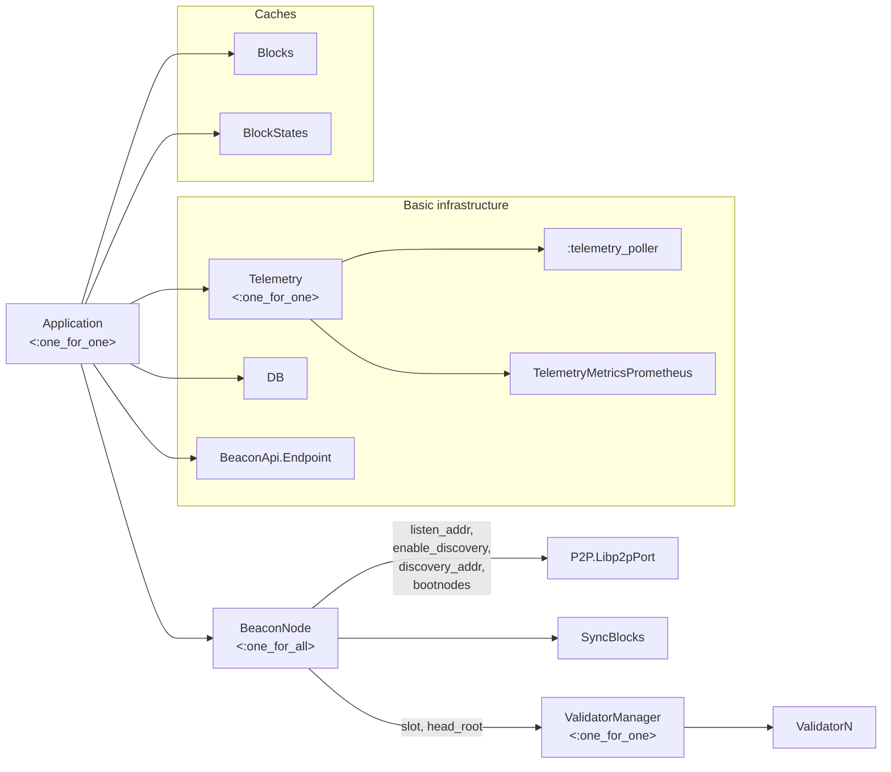
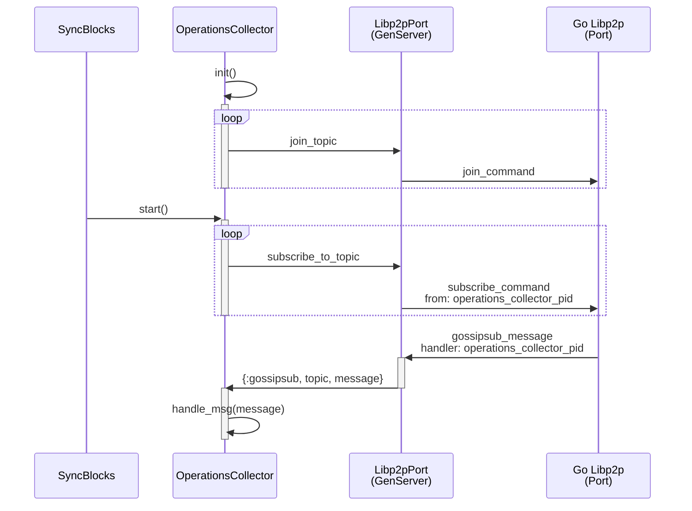
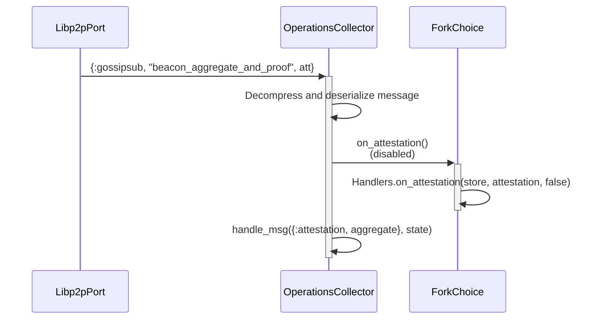
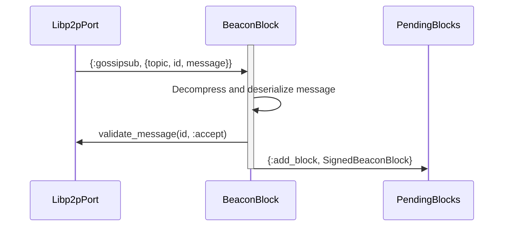
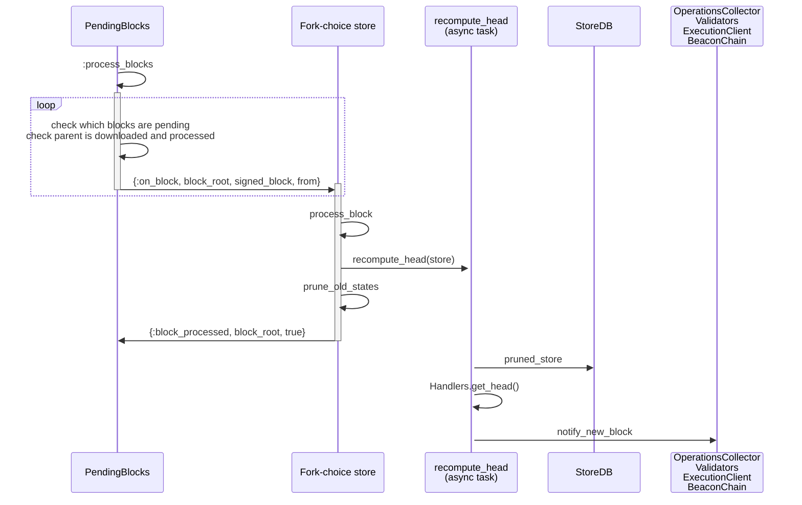
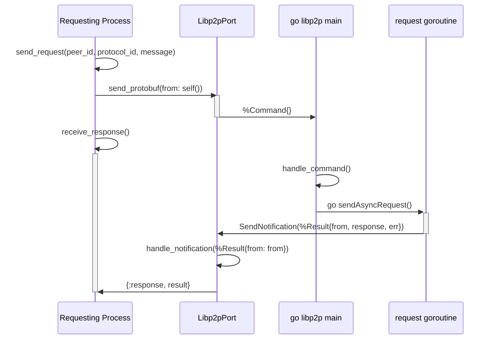

# Architecture of the consensus node

## Processes summary

This is our complete supervision tree.



Each box is a process. If it has children, it's a supervisor, with it's restart strategy clarified. 

If it's a leaf in the tree, it's a GenServer, task, or other non-supervisor process. The tags in the edges/arrows are the init args passed on children init (start or restart after crash).

## P2P Events

This section contains sequence diagrams representing the interaction of processes through time in response to a stimulus. The main entry point for new events is through gossip and request-response protocols, which is how nodes communicates between each other.

Request-response is a simple protocol where client request for specific data such as old blocks that they may be missing or other clients metadata.

Gossip allows clients to subscribe to different topics (hence the name "gossipsub") they are interested in, and get updates for them. This is how a node receives new blocks or attestations from their peers.

We use the `go-libp2p` library for the networking primitives, which is an implementation of the `libp2p` networking stack. We use ports to communicate with a go application and Broadway to process notifications. This port has a GenServer owner called `Libp2pPort`.

## Gossipsub

### Subscribing

At the beginning of the application we subscribe a series of handler processes that will react to new gossipsub events:

- `Gossip.BeaconBlock` will handle topic `/eth2/<context>/beacon_block/ssz_snappy`.
- `Gossip.BlobSideCar` will subscribe to all blob subnet topics. They're names are of the form `/eth2/<context>/blob_sidecar_<subnet_index>`.
- `Gossip.OperationsCollector` will subscribe to operations `beacon_aggregate_and_proof` (attestations), `voluntary_exit`, `proposer_slashing`, `attester_slashing`, `bls_to_execution_change`.

This is the process of subscribing, taking the operations collector as an example:



Joining a topic allows the node to get the messages and participate in gossip for that topic. Subscribing means that the node will actually read the contents of those messages.

We delay the subscription until the sync is finished to guarantee that we're at a point where we can process the messages that we receive.

This will send the following message to the go libp2p app:

```elixir
%Command{
    from: self() |> :erlant.term_to_binary(),
    c: {:subscribe, %SubscribeToTopic{name: topic_name}}
}
```

`self` here is the caller, which is `OperationsCollector`'s pid. The go side will save that binary representation of the pid and attach it to gossip messages that arrive for that topic. That is, the messages that will be notified to `Libp2pPort` will be of the form:

```elixir
%Gossipsub{
    handler: operations_collector_pid,
    message: message,
    msg_id: id
}
```

The operations collector then handles that message on `handle_info`, which means it deserializes and decompresses each message and then call specific handlers for that topic.

### Receiving an attestation

This is the intended way to process attestations in the current architecture, although the fork choice call is disabled and only attestations in blocks are being processed.



When receiving an attestation, the ForkChoice GenServer takes the current store object and modifies it using the [`on_attestation`](https://eth2book.info/capella/annotated-spec/#on_attestation) handler. It validates it and updates the fork tree weights and target checkpoints. The attestation is only processed if this attestation is the latest message by that validator. If there's a newer one, it should be discarded.

The most relevant piece of the spec here is the [get_weight](https://eth2book.info/capella/annotated-spec/#get_weight) function, which is the core of the fork-choice algorithm. In the specs, this function is called on demand, when calling [get_head](https://eth2book.info/capella/annotated-spec/#get_head), works with the store's values, and recalculates them each time. In our case, we cache the weights and the head root each time we add a block or attestation, so we don't need to do the same calculations again.

**To do**: we should probably save the latest messages in persistent storage as well so that if the node crashes we can recover the tree weights.

### Receiving a block

A block is first received and sent to the `PendingBlocks` GenServer, which checks if the block has everything needed or if it's duplicated before letting it be processed.



However, the block isn't processed immediately. Once every 500ms, `PendingBlocks` checks if there are blocks that should be processed and does so.



For the happy path, shown above, fork choice store calculates the state transition, and notifies the pending blocks GenServer that the block was correctly processed, so it can mark it as such.

Asynchronously, a new task is started to recompute the new head, as this takes a significant amount of time. When the head is recomputed, multiple processes are notified.

## Request-Response

Request-response is an on-demand protocol where a node asks for information directly to a peer and expects a response. This may be to request metadata that corresponds to that peer for discovery purposes, or to request information from the past that will not appear on when listening to gossip (useful for checkpoint sync).

It's implemented in the following way:



Explained, a process that wants to request something from Libp2pPort sends a request with its own pid, which is then included in the Command payload. The request is handled asynchronously in the go side, and eventually, the pid is included in the response, and sent back to LibP2PPort, who now knows to which process it needs to be dispatched.

The specific kind of command (a request) is specified, but there's nothing identifying this is a response vs any other kind of result, or the specific kind of response (e.g. a block download vs a blob download). Currently the only way this is handled differentially is because the pid is waiting for a specific kind of response and for nothing else at a time.

## Validators

Validators are separate processes. They react to:

- Clock ticks: this allows them to compute their duties for different sections of the slot:
  - First third: producing a block and sending it to the general gossip channel.
  - Second third: Attesting for a block and sending it to a subnet.
  - Last third: aggregating attestations from a subnet and sending them over the general gossip network.
- Fork choice results (head updates): these are needed by the validators to build the blocks accordingly when proposing, as they will get the head state, create a block on top of it and apply a state transition.

### Attester duty calculation

Duties are calculated by the `LambdaEthereumConsensus.Validator.Duties` module. This should be done once every epoch. In the current implementation it's done when:

- A new head appears for the same current slot.
- There's an epoch change.

A validator must attest once per epoch, in one committee. There are multiple committees per slot. In the current design, all attestation committees are calculated for every slot of the epoch, and then the one containing the validator is returned, thus obtaining the slot and committee index within the slot for that validator.

There's some room for optimizations here:

- We should calculate the committees only once for all validators.
- We should not calculate the full committees, we should only shuffle the validators that we are handling to know in which slot and committee they are in an epoch.

### Proposing duties

There's only one block proposer per slot and there are about 1 million validators in mainnet. That means that a block will be chosen approximately once every 12 million seconds (a slot is 12 seconds), which is roughly 4 months and 19 days.

Each proposer index is calculated for the whole epoch, using the hash of the epoch's randao mix + metadata as a seed.

This too could be calculated only once for all validators, but it's not as big as a task compared to calculating all committees.

### Building blocks

When proposing a block, the "block builder" is used.

In the previous block to proposing, the payload build starts:

- The head block and state are fetched from the db.
- The block metadata is obtained from the blocks execution payload.
- Slots are processed if necessary.
- The execution client is notified of the fork choice update.

In the proposing slot:

- The process of getting the pre-state, processing slots, etc. is repeated (this could be optimized).
- The execution payload and blob bundle are requested directly to the execution client for the corresponding payload_id.
- The operations (slashings, attestations voluntary exits) that were collected from gossip are added to the block.
- The deposits and eth1_vote are fetched from `ExecutionChain`.
- The block is signed.

## Execution Chain

The consensus node does not live in isolation. It communicates to the execution client. We implemented, in the `ExecutionClient` module, the following primitives:

- `notify_forkchoice_updated(fork_choice_state)`: first message sent to the execution client right after exchanging capabilities. It returns if the client is syncing or valid.
- `notify_forkchoice_updated(fork_choice_state, payload_attributes)`: sent to update the fork choice state in the execution client (finalized and head payload hash). This starts the execution payload build process. Returns a `payload_id` that will be used at block building time to get the actual execution payload. It's sent in the slot prior to proposing. It might return a null id if the execution client is still syncing.
- `get_payload(payload_id)`: returns an `{ExecutionPayload.t(), BlobsBundle.t()}` tuple that started building when `notify_forkchoice_updated` was called with payload attributes.
- `notify_new_payload(execution_payload, versioned_hashes, parent_beacon_block_root)`: when the execution client gets a new block, it needs to check if the execution payload is valid. This method is used to send that payload for verification. It may return valid, invalid, or syncing, in the case where the execution client is not yet synced.

Aside from payload validation and block building, there's a bit more information we need from the execution client:

- Deposits: transactions to the deposit contract are processed by the execution client and held in logs. We can `get_deposit_logs(block_range)` to get those. We save those in a deposit tree, which is used to transmit the deposits cheaply to syncing nodes (sending deposit snapshots, see [EIP-4881](https://eips.ethereum.org/EIPS/eip-4881)).
- Eth1 vote: the ultimate goal in consensus is not only to chose the right fork, but also to agree on what that head beacon block refers to in the execution chain. We summarize the execution state in `Eth1Data`, a container with the deposit root, deposit amount, and execution block hash. In the current beacon state we save the current eth1 data, and a history of the last N ones.

## Checkpoint sync

**TO DO**: document checkpoint sync.

## Next document

Let's go over [Fork Choice](fork_choice.md) to see a theoretical explanation of LMD GHOST.
