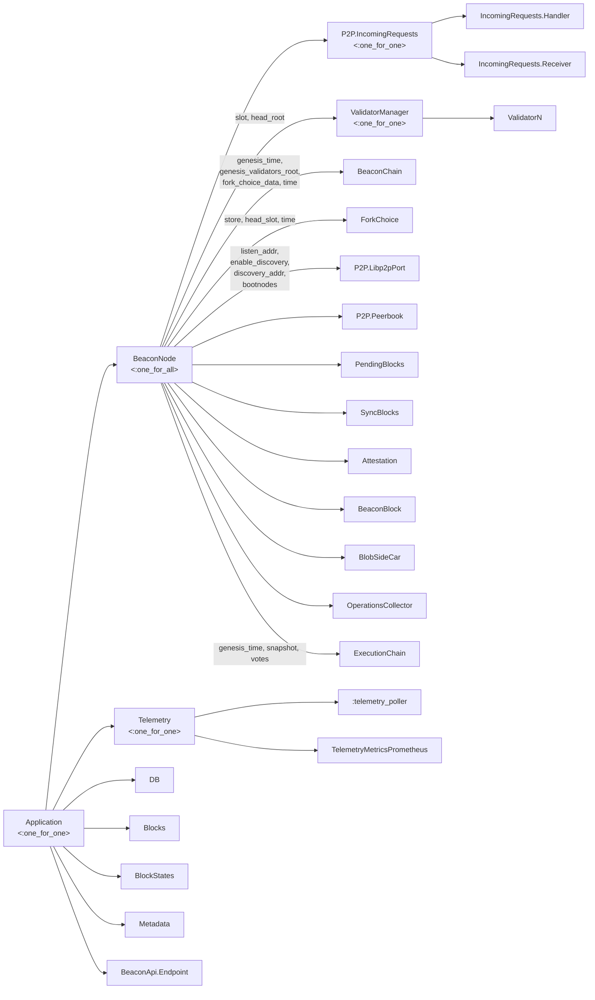

# Architecture of the consensus node

## Processes summary

### Supervision tree

This is our complete supervision tree.



Each box is a process. If it has children, it's a supervisor, with it's restart strategy clarified. 

If it's a leaf in the tree, it's a GenServer, task, or other non-supervisor process. The tags in the edges/arrows are the init args passed on children init (start or restart after crash).

### High level interaction

This is the high level interaction between the processes.


## Sequences

This section contains sequence diagrams representing the interaction of processes through time in response to a stimulus. The main entry point for new events is through gossip and request-response protocols, which is how nodes communicates between each other.

Request-response is a simple protocol where client request for specific data such as old blocks that they may be missing or other clients metadata.

Gossip allows clients to subscribe to different topics (hence the name "gossipsub") they are interested in, and get updates for them. This is how a node receives new blocks or attestations from their peers.

We use the `go-libp2p` library for the networking primitives, which is an implementation of the `libp2p` networking stack. We use ports to communicate with a go application and Broadway to process notifications. This port has a GenServer owner called `Libp2pPort`.

# Gossipsub

### Subscribing

At the beginning of the application we subscribe a series of handler processes that will react to new gossipsub events:

- `Gossip.BeaconBlock` will handle topic `/eth2/<context>/beacon_block/ssz_snappy`.
- `Gossip.BlobSideCar` will subscribe to all blob subnet topics. They're names are of the form `/eth2/<context>/blob_sidecar_<subnet_index>`.
- `Gossip.OperationsCollector` will subscribe to operations `beacon_aggregate_and_proof` (attestations), `voluntary_exit`, `proposer_slashing`, `attester_slashing`, `bls_to_execution_change`.

This is the process of subscribing, taking the operations collector as an example:


Joining a topic allows the node to get the messages and participate in gossip for that topic. Subscribing means that the node will actually read the contents of those messages.

We delay the subscription until the sync is finished to guarantee that we're at a point where we can process the messages that we receive.

This will send the following message to the go libp2p app:

```elixir
%Command{
    from: self() |> :erlant.term_to_binary(),
    c: {:subscribe, %SubscribeToTopic{name: topic_name}}
}
```

`self` here is the caller, which is `OperationsCollector`'s pid. The go side will save that binary representation of the pid and attach it to gossip messages that arrive for that topic. That is, the messages that will be notified to `Libp2pPort` will be of the form:

```elixir
%Gossipsub{
    handler: operations_collector_pid,
    message: message,
    msg_id: id
}
```

The operations collector then handles that message on `handle_info`, which means it deserializes and decompresses each message and then call specific handlers for that topic.

### Receiving an attestation

This is the intended way to process attestations in the current architecture, although the fork choice call is disabled and only attestations in blocks are being processed.


When receiving an attestation, the ForkChoice GenServer takes the current store object and modifies it using the [`on_attestation`](https://eth2book.info/capella/annotated-spec/#on_attestation) handler. It validates it and updates the fork tree weights and target checkpoints. The attestation is only processed if this attestation is the latest message by that validator. If there's a newer one, it should be discarded.

The most relevant piece of the spec here is the [get_weight](https://eth2book.info/capella/annotated-spec/#get_weight) function, which is the core of the fork-choice algorithm. In the specs, this function is called on demand, when calling [get_head](https://eth2book.info/capella/annotated-spec/#get_head), works with the store's values, and recalculates them each time. In our case, we cache the weights and the head root each time we add a block or attestation, so we don't need to do the same calculations again.

**To do**: we should probably save the latest messages in persistent storage as well so that if the node crashes we can recover the tree weights.

### Receiving a block

A block is first received and sent to the `PendingBlocks` GenServer, which checks if the block has everything needed or if it's duplicated before letting it be processed.


However, the block isn't processed immediately. Once every 500ms, `PendingBlocks` checks if there are blocks that should be processed and does so.


For the happy path, shown above, fork choice store calculates the state transition, and notifies the pending blocks GenServer that the block was correctly processed, so it can mark it as such.

Asynchronously, a new task is started to recompute the new head, as this takes a significant amount of time. When the head is recomputed, multiple processes are notified.

## Request-Response

Request-response is an on-demand protocol where a node asks for information directly to a peer and expects a response. This may be to request metadata that corresponds to that peer for discovery purposes, or to request information from the past that will not appear on when listening to gossip (useful for checkpoint sync).

It's implemented in the following way:


Explained, a process that wants to request something from Libp2pPort sends a request with its own pid, which is then included in the Command payload. The request is handled asynchronously in the go side, and eventually, the pid is included in the response, and sent back to LibP2PPort, who now knows to which process it needs to be dispatched.

The specific kind of command (a request) is specified, but there's nothing identifying this is a response vs any other kind of result, or the specific kind of response (e.g. a block download vs a blob download). Currently the only way this is handled differentially is because the pid is waiting for a specific kind of response and for nothing else at a time.

### Checkpoint sync

**TO DO**: document checkpoint sync.

## Next document

Let's go over [Fork Choice](fork_choice.md) to see a theoretical explanation of LMD GHOST.
