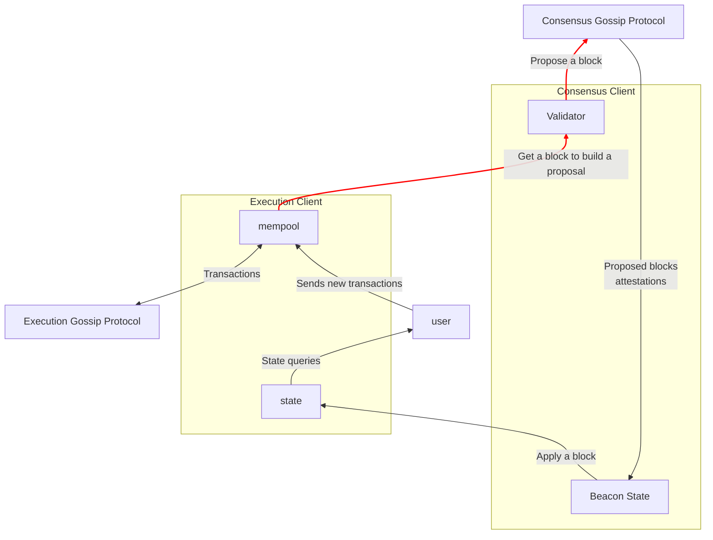

# Clients

As we talked previously, Ethereum is a network made by different computers. Its workflow would work, in theory, as follows:

- A user of the network sends a transaction (e.g. an eth transfer) to the network.
- The network validates the transaction.
- The network includes the transaction in a block.
- The network includes the block in the chain, so the new state includes the transaction sent by the user. Any user can request this information and the change will be reflected.

The problem here is: what does sending something to the network mean?

## How does this actually work? Who talks with who?

Ideally, each user has its own node installed in their computer and they interact with the network by sending their transactions and queries to their own node. This node propagates the message to other nodes and receives propagated messages from its peers to update its own view of the EVM state. When the user queries some state, the node answers with its own view.

A full node is split into two clients:

- **The execution client** knows how to represent EVM state and apply state changes (transactions) to generate new states. It represents the state machine.
- **The consensus client** knows very little about the state machine, but knows how to choose between different worldviews and agree with other nodes. It enables the execution client to apply the correct state transitions.

Here's a block diagram of their interactions:

You might notice there's a section called "validator" in there, with red arrows. Your node is considered a validator if it has 32 ETH staked in the validator contract, which makes it capable of proposing new blocks and attesting for other proposals. That is: actively participating in the protocol and getting rewards for it.

If you're not a validator you can still participate though! The block diagram is the same, without the red lines (and you won't receive rewards for it). You can still send transactions to your local node, propagate it to others and receive updates.

## Lifecycle of a transaction

Here's the full sequence from the perspective of a non validator node:

1. A user builds, signs and sends a transaction to their execution client's JSON-RPC API. This is usually done with a wrapper library like `ethers` , `hardhat` or `foundry`.
2. The execution client receives the transaction and:
    1. Validates it (checks the user has enough ETH, the signature matches, etc).
    2. Adds it to its local mempool. The mempool is a local pool of transactions that are not yet executed.
    3. Broadcasts it through the execution gossip layer, to other execution nodes. Other execution nodes include it in their own mempools.
3. A validator node is selected as a block proposer. As a proposer:
    1. Their execution client bundles many transactions from its mempool into a block.
    2. All transactions in the bundle are executed locally and state change calculated.
    3. Their consensus client gets this block (or as consensus calls it, "execution payload") and adds consensus layer information, like attestations, slashings, rewards, penalties, etc. The execution payload + consensus metadata forms a "beacon block".
    4. The beacon block is signed and sent over the consensus gossip layer to other nodes.
4. A committee of validators validates that block and sends signed attestations for it over the consensus gossip protocol too.
5. All nodes receive both the new proposed block and attestations. Then they:
    1. Include the new block in their own local fork tree if its valid.
    2. Save the attestations and update the weights of the blocks on the tree.
    3. Apply fork choice to recalculate, if necessary, what blocks are included in the canonical chain.
    4. The changes + the new block are propagated to the execution node so transactions are applied and state is changed and up to date.

## Caveats

This is the ideal happy path. There are other ways in which this can work, and ways in which something can go wrong:

- Not all users run their own node. They use services like infura or alchemy, that take JSON-RPC requests and process them with their own nodes. Wallets like metamask, for instance, use these.
- There are intermediaries like flashbots, which are outside of the scope of this documentations, that cause variations in the "who talks to who" diagram.

In the [next document](architecture.md), we discuss zoom into the consensus node and how it works.
