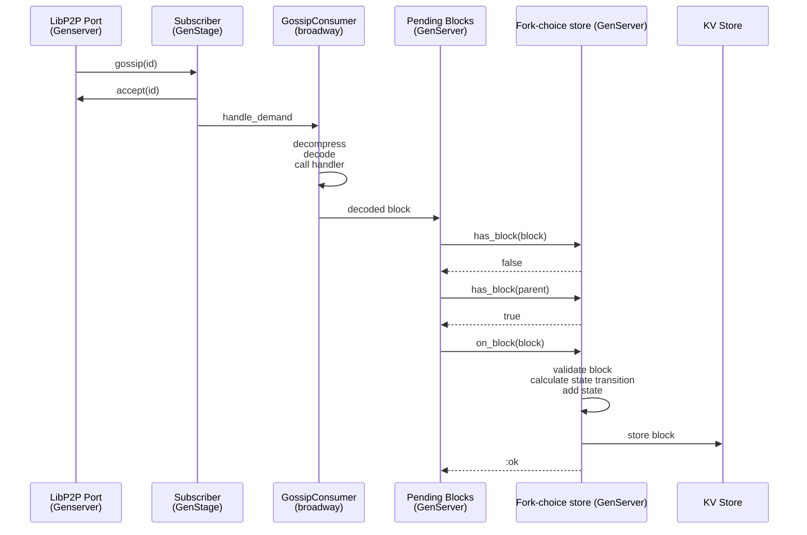
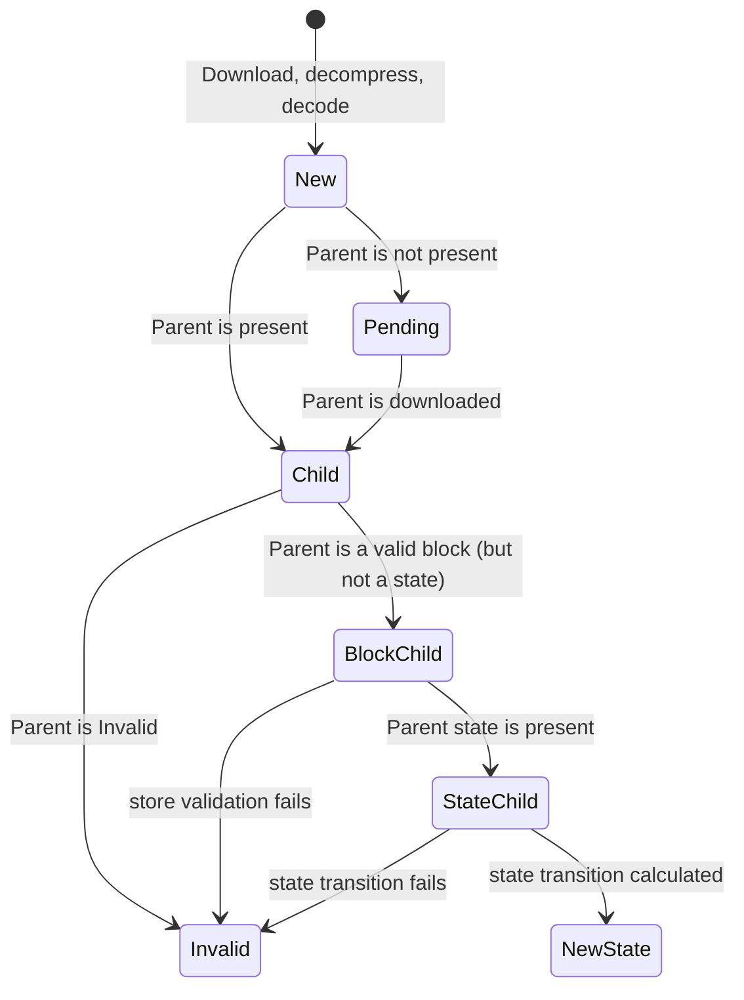
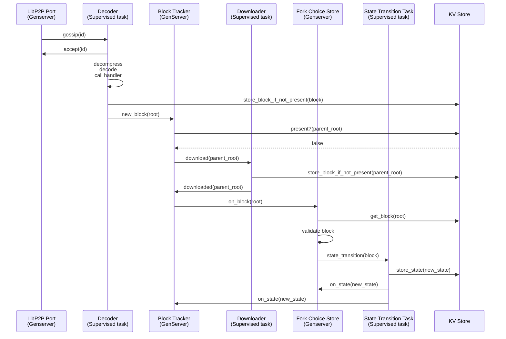

# Store concurrency design

## Current situation

The following is a sequence diagram on the lifecycle of a block, from the moment its notification arrives in the LibP2P port and until it's processed and saved. Each lane is a separate process and may encompass many different modules.

Let's look at the main issues and some improvements that may help with them.

### Blocking Calls

`Store.on_block(block)` (write operation) is blocking. This operation is particularly big, as it performs the state transition. These causes some issues:

- It's a call, so the calling process (in our case the pending blocks processor) will be blocked until the state transition is finished. No further blocks will be downloaded while this happens.
- Any other store call (adding an attestation, checking if a block is present) will be blocked. 

Improvements:

- Making it a `cast`. The caller doesn't immediately need to know what's the result of the state transition. We can do that an async operation.
- Making the state transition be calculated in an async way, so the store can take other work like adding attestations while the cast happens.

### Concurrent downloads

Downloading a block is:

- A heavy IO operation (non-cpu consuming).
- Independent from downloading a different block.

Improvements:
- We should consider, instead of downloading them in sequence, downloading them in different tasks.

### Big Objects in Mailboxes

Blocks are pretty big objects and they are passed around in process mailboxes even for simple calls like `Store.has_block(block)`. We should minimize this kind of interactions as putting big structures in mailboxes slows their processing down.

Improvements:

- We could store the blocks in the DB immediately after downloading them.
- Checking if a block is present could be done directly with the DB, without need to check the store.
- If we want faster access for blocks, we can build an ETS block cache.

### Other issues

- States aren't ever stored in the DB. This is not a concurrency issue, but we should fix it.
- Low priority, but we should evaluate dropping the Subscriber genserver and broadway, and have one task per message under a supervisor.

## State Diagram

These are the states that a block may have:

- New: just downloaded, decompressed and decoded
- Pending: no parent.
- Child. Parent is present and downloaded.
- BlockChild: Parent is a valid block.
- StateChild: Parent’s state transition is calculated.
- Included: we calculated the state transition for this block and the state is available. It's now part of the fork tree.

The block diagram looks something like this:

### A possible new design

Some pending definitions:

- The block tracker could eventually be a block cache, and maintain blocks and their state in an ETS that can be accessed easily by other processes.
