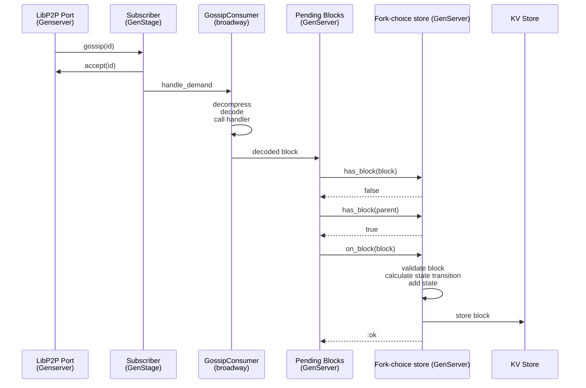
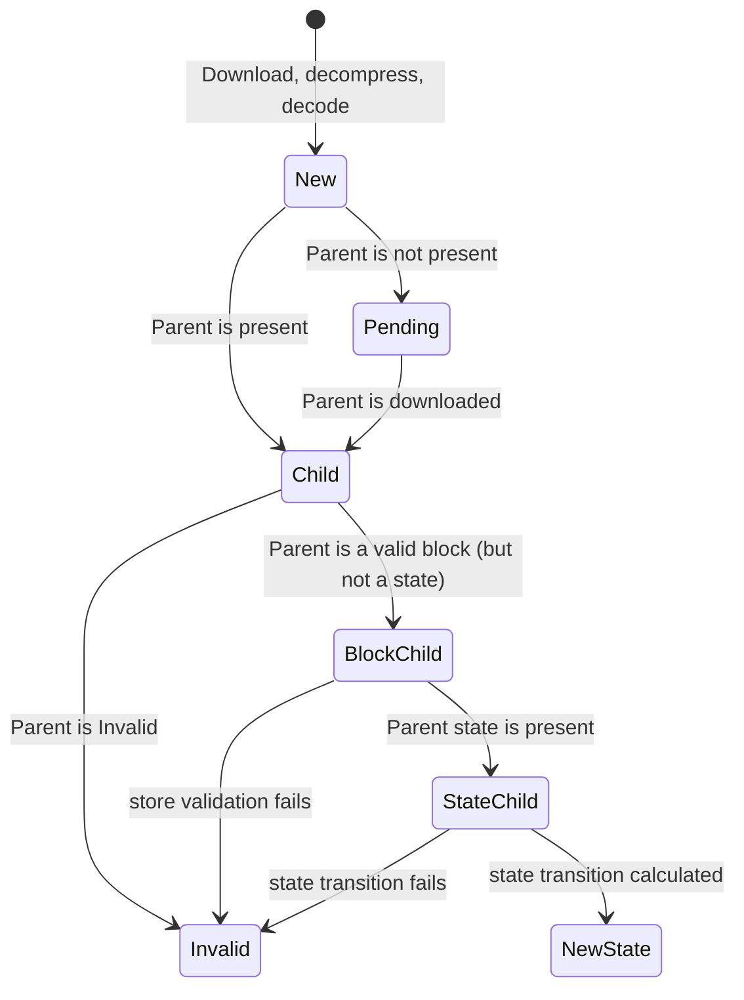
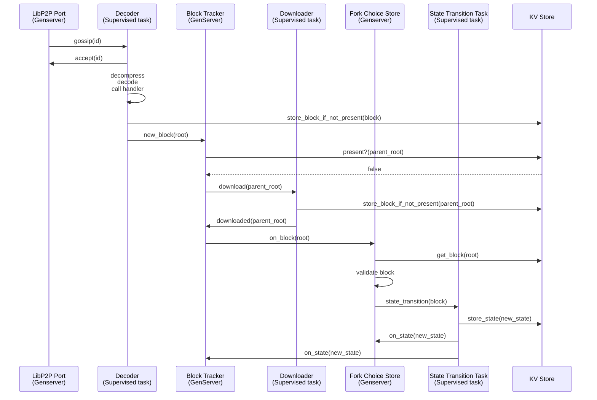
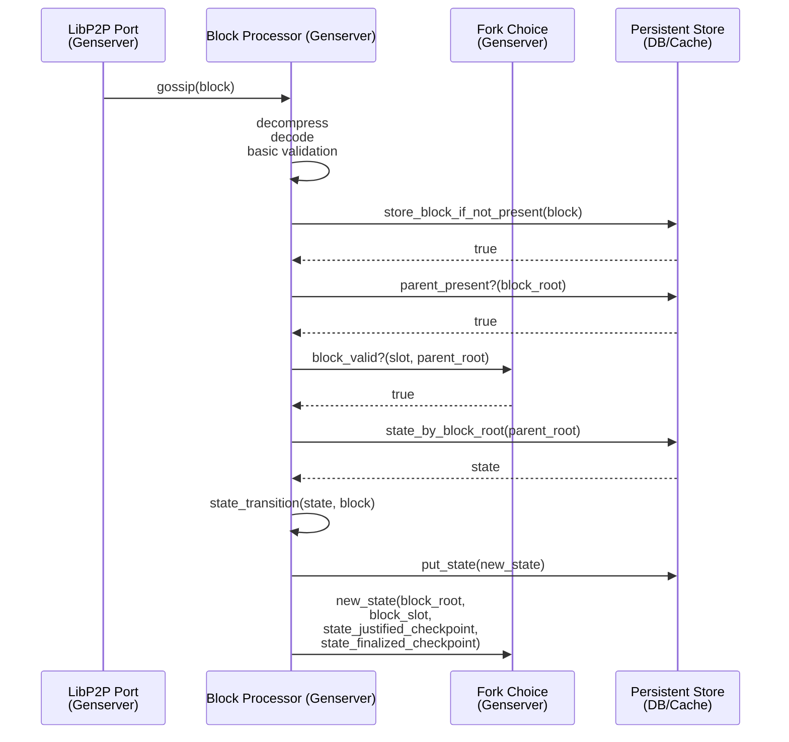
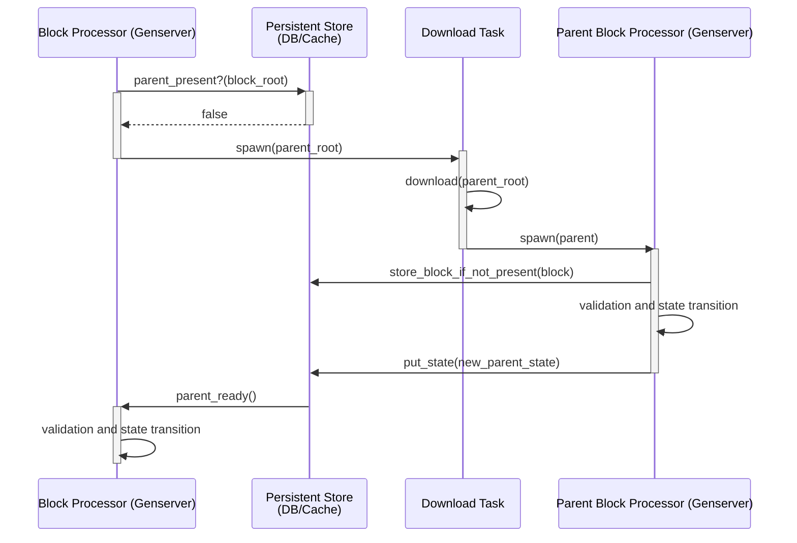

# Store concurrency design

## Current situation

The following is a sequence diagram on the lifecycle of a block, from the moment its notification arrives in the LibP2P port and until it's processed and saved. Each lane is a separate process and may encompass many different modules.

Let's look at the main issues and some improvements that may help with them.

### Blocking Calls

`Store.on_block(block)` (write operation) is blocking. This operation is particularly big, as it performs the state transition. These causes some issues:

- It's a call, so the calling process (in our case the pending blocks processor) will be blocked until the state transition is finished. No further blocks will be downloaded while this happens.
- Any other store call (adding an attestation, checking if a block is present) will be blocked. 

Improvements:

- Making it a `cast`. The caller doesn't immediately need to know what's the result of the state transition. We can do that an async operation.
- Making the state transition be calculated in an async way, so the store can take other work like adding attestations while the cast happens.

### Concurrent downloads

Downloading a block is:

- A heavy IO operation (non-cpu consuming).
- Independent from downloading a different block.

Improvements:
- We should consider, instead of downloading them in sequence, downloading them in different tasks.

### Big Objects in Mailboxes

Blocks are pretty big objects and they are passed around in process mailboxes even for simple calls like `Store.has_block(block)`. We should minimize this kind of interactions as putting big structures in mailboxes slows their processing down.

Improvements:

- We could store the blocks in the DB immediately after downloading them.
- Checking if a block is present could be done directly with the DB, without need to check the store.
- If we want faster access for blocks, we can build an ETS block cache.

### Other issues

- States aren't ever stored in the DB. This is not a concurrency issue, but we should fix it.
- Low priority, but we should evaluate dropping the Subscriber genserver and broadway, and have one task per message under a supervisor.

## State Diagram

These are the states that a block may have:

- New: just downloaded, decompressed and decoded
- Pending: no parent.
- Child. Parent is present and downloaded.
- BlockChild: Parent is a valid block.
- StateChild: Parent’s state transition is calculated.
- Included: we calculated the state transition for this block and the state is available. It's now part of the fork tree.

The block diagram looks something like this:

### A possible new design

Some pending definitions:

- The block tracker could eventually be a block cache, and maintain blocks and their state in an ETS that can be accessed easily by other processes.

## Another possible design: per-block processes

Conceptually, the core concurrency issue of the current design is that we use processes to represent steps instead of them representing independent pieces of computation/data. Most of the inter-process communication is call-based and sequential, effectively blocking processes while still adding the overhead of message passing and mailboxes with big objects like blocks and states.

What we need is to have one process per independent task. In our case, our independent unit for is **the block processing**. We need to have a **single process per block**, that takes care of:

- Decompressing
- Deserializing
- Saving the block to the DB/caches/fork-tree
- Validating
- Performing state transition.
- Saving the state to the DB/cache
- At the end of all, updating the global store (this is a very fast operation, contrary to state transition).

With this strategy in mind, the block won’t need to be passed around during its lifetime, and state transitions may happen in parallel without the need to spawn tasks on demand.

There are some tasks that, of course, will require interaction with the outside world:

- When a parent is missing, we need to download it. The block processor may pause until it receives a notification that the parent was downloaded and transitioned. After that, it may continue with its own state transition.
- When validating it will need to interact with the global fork choice store. This just requires validating a few parameters like the epoch/slot, which is a fast process, so it’s a relatively simple call without passing the full block and without changing the store state.
- The final step is updating the store/beacon chain state, which still doesn’t need to pass around big state and is fast. If additional validations are performed or repeated, it doesn’t represent a big performance hit.

### Happy path diagram

We can see here that:

1. We don’t need to send full blocks or states anywhere except to/from the db/cache.
2. Most operations are independent and the interactions (e.g. the validation or the new_state) are cheap.

### Missing Parent diagram

This is a simplified sequence diagram highlighting the differences when the parent block is not present. To summarize:

- The block processor spawns a download task under a download supervisor.
- When the download finishes it will start a block processor for the parent, repeating the whole process for the parent.
- When the parent finishes the state transition, it will have saved both the block and the state to the persistent store.
- The store will then notify the child block processor that it can now proceed with its own state transition.

Note that the persistent store here is a simplified structure. Internally, it will contain the fork tree and the cache. The fork tree will contain the relationship between blocks (the tree structure), which will enable to get a block’s children without iterating through the DB.

### Conclusions

Benefits of this approach:
- Parallelizes state transitions when different forks appear, and other tasks not related to having multiple forks, like deserialization or decompression of incoming requests.
- Removes the blocking pipeline. `Pending blocks` won't block while it waits for a state transition to happen. The store or beacon chain won't block either. Because of this, we can process all of the incoming gossip continuously, and discard the ones that are not valid early, without their validation depending on other blocks being processed. This also reduces the size of the processes mailbox.
