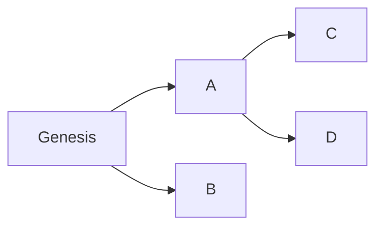
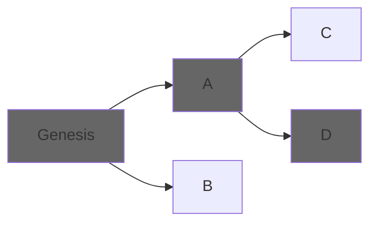
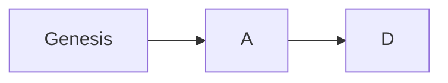

# Consensus basics

## What is the EVM and Ethereum

EVM is a byzantine, distributed state machine. That means: 

- State machine: there is a state, and there are known ways of going from one state to a different one, called _transactions_.
- Distributed: this state is stored in many computers, and all know how to run transactions. Ideally, the network should be seen from the outside world as a single machine with a single, consistent state.
- Byzantine: the set of participating computers is not controlled or pre-known.

The goal of the EVM is to have all computers cooperate in a permissionless tamper-proof way.

## The log, which you may know as a chain

A classical approach to representing a distributed state is to store all changes from the beginning of time until the present: a transaction log. If every node applies the same transactions in the same order, beginning from the same starting point, they will reach the same final state.

Storing the log is useful because each state change is immutable, and agreeing on them is easier than agreeing on the current state, which is always changing.

Agreeing on the log is agreeing on the current state. How do we do that? We need two things: Sybil resistance and consensus algorithms.

## Sybil resistance

In a byzantine, trustless environment, we need to take several measures to make the network safe:

- Cryptographic signatures validate the authority of transactions.
- Transactions are batched in blocks so the overhead of consensus is reduced.
- Verifying the integrity of blocks needs to be easy. For this reason, each block is linked to its parent, each block has a hash of its own contents, and part of each block's content is its parent hash. That means that changing any block in history will cause noticeable changes in the block's hash. **This makes the log a blockchain**.
- We need nodes to pay a price for participating in consensus, or they can create millions of virtual nodes to vote/spam the network. Proof of work makes nodes solve very hard puzzles that take a lot of computational time and power so they can propose new blocks. Proof of stake does this more directly, with money: to propose a new block, you need to have 32 ETH staked and wait for your predetermined turn. If you do something invalid, other nodes will notice and punish you.

## Consensus algorithms

Each node has its own view of the log and the state. Each node shares its own view of the state by sending each other blocks. In Ethereum, liveness is prioritized over safety, by allowing "forks": different versions of history can be live at the same time. Due to networking delays (e.g. block production being faster than propagation) or client differences, a client may receive two different blocks at the same time as the next one.

This means that instead of a blockchain we get a block tree, where each branch is called a "fork". Consensus, in this context, means nodes need to choose the same forks as the canonical chain so that they share the same history. The criteria for choosing from a particular fork is called the "Fork-choice algorithm".

Genesis will always be chosen as it will be the first block in any chain. Afterward, if blocks A and D are chosen by the algorithm, that means the canonical chain will now be:

## Ethereum consensus algorithms

In post-merge Ethereum, consensus is reached by two combined fork-related algorithms:

- LMD GHOST: a fork-choice algorithm based on votes (attestations). If a majority of nodes follow this algorithm, they will tend to converge to the same canonical chain. We expand more on it on [this document](fork_choice.md).
- Casper FFG: provides some level of safety by defining a finalization criterion. It takes a fork tree and defines a strategy to prune it (make branches inaccessible). Once a block is tagged as "final", blocks that aren't either parents (which are also final) or descendants of it, are not valid blocks. This prevents long reorganizations, which might make users vulnerable to double-spends. We expand on it in [this document](finality.md).

The recommended next read is the [clients document](clients.md), which explains, at a high level, how Ethereum nodes interact with each other.
