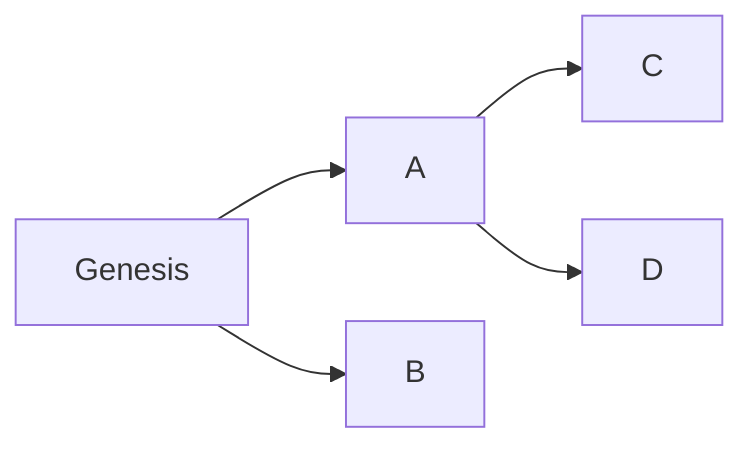
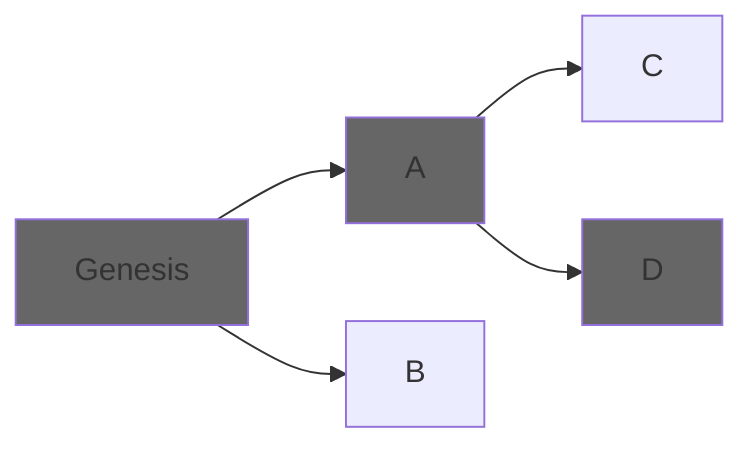
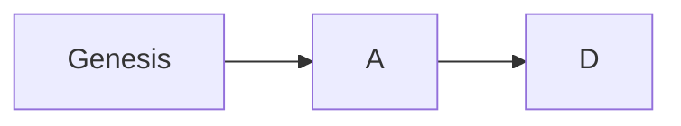

# Consensus basics

## Classic consensus

As a distributed state machine, the EVM takes some elements from classic consensus algorithms, such as [Raft](https://raft.github.io/):

- Users of the network send commands (transactions) to change the state of the EVM.
- Nodes propagate those transactions.
- A leader is elected and proposes a transaction to be the next one to be applied.
- As there's a single leader, each node will receive that transaction and add it to its local copy of the transaction history.
- Mechanisms are put in place so that nodes make sure that they have the same order of transactions and applying them to their local state machines is safe.

Algorithms like Raft assume a setup where nodes are known, running the same software, well intentioned, and the only problems arise from network/connectivity issues, which are inherent to any distributed system. They prioritize safety and require 50% of the network plus one node to be live in order to be available.

## Bizantine consensus

Blockchains like ethereum are designed to prioritize liveness in a bizantine environment, where anyone can join the network running a software that may be different, due to bugs or intentionally ill-intentioned. This means there are several fundamental differences:

- Cryptographic signatures are introduced to validate authority of transactions.
- Transactions are batched into blocks, so that the consensus overhead is reduced.
- Verifying the integrity of blocks needs to be easy. For this reason each block is linked to its parent, each block has a hash of its own contents, and part of each block's content is its parent hash. That means that changing any block in history will cause noticeable changes in the block's hash.
- Leaders are not elected by a simple majority, but by algorithms such as proof of work or proof of stake, that introduce economic incentives so that participating in consensus is not cost-free and chances of spamming the protocol are reduced. They are only elected for a single block and the algorithm is repeated for the next one.

## Forks

In ethereum, liveness is prioritized over safety, by allowing forks: different versions of history can be live at the same time. Due to networking delays (e.g. block production being faster than propagation) or client differences, a client may receive to different blocks at the same time as the next one.

This means that instead of a block chain we get a block tree, were each branch is called a "fork". Consensus, in this context, means nodes need to chose the same forks as the canonical chain, so that they share the same history. The criteria to chose from a particular fork is called "Fork-choice algorithm".

Genesis will always be chosen as it will be the first block in any chain. Afterwards, if blocks A and D are chose by the algorithm, that means the canonical chain will now be:

## Ethereum consensus algorithms

In post-merge Ethereum, consensus is reached by two combined fork-related algorithms:

- LMD GHOST: provides per-slot liveness by allowing blocks to be added in separate forks if they are not in the chain percieved as canonical.
- Casper FFC: provides some level of safety by defining a finalization criterion. It takes a fork tree and defines a strategy to prune it (make branches inaccessible). Once a block is tagged as "final", blocks that aren't either parents (which are also final) or decendents of it, are not valid blocks. This prevents long reorganizations, which might make users vulnerable to double spends.

Here we expand a bit on those:

- Fork choice: [LMD GHOST](fork_choice.md).
- Finality: [Casper FFC](finality.md).

### Attestation messages

A single vote emitted by a validator consists of the following information:

- slot at which the attestation is being emmited.
- index: index of the validator within the comittee.
- beacon block root: the actual vote. This identifies a block by the merkle root of its beacon state.
- source: checkpoint
- target: checkpoint

This messages are propagated either directly (attestation gossip) or indirectly (contained in blocks).
