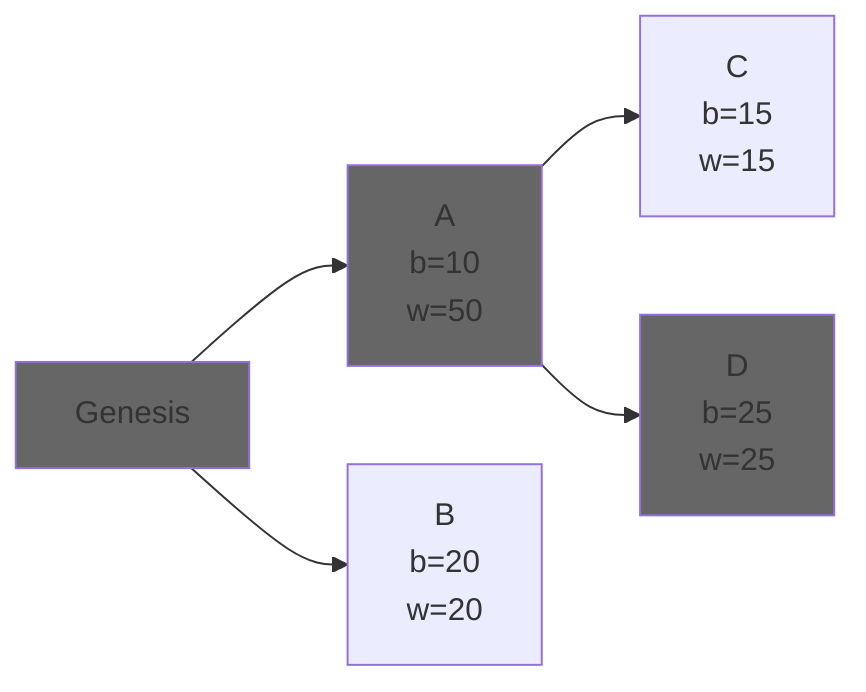

# Fork-choice: LMD GHOST

Let's separate the two parts of the name.

- GHOST: Greediest, heaviest-observed sub-tree. The algorithm recognizes that by voting block B, we also vote its parent, block A, so the amount of votes of A represents the "weitght" of that whole tree.
- LMD: in proof of work, each block would be a single vote for its parents. In proof of stake, each validator gives attestations/votes to the block they think is the current head of the chain (message driven). "Latest" means that only the last attestation for each validator will be taken into account.

By choosing a fork, each node has a single, linear chain of blocks that it considers canonical. The last child of that chain is called the chain's "head".

## Reacting to an attestation

When an attestation arrives, the `on_attestation` callback must:

1. Perform the [validity checks](https://eth2book.info/capella/part3/forkchoice/phase0/#validate_on_attestation). tl;dr: the slot and epoch need to be right, the vote must be for a block we have, validate the signature and check it doesn't conflict with a different attestation by the same validator.
2. [Save the attestation](https://eth2book.info/capella/part3/forkchoice/phase0/#update_latest_messages) as that validator's latest message. If there's one already, update the value.

## Choosing forks

We now have a store of each validator's latest vote, which allows LMD GHOST to work as a `get_head(store) -> Block` function.

We first need to calculate each block's weight:

- For leaf blocks, we calculate their weight by checking how much votes they have.
- For each branch block we calculate its weight as the sum of the weight of every child, plus its own votes. We repeat this until we reach the root, which will be the last finalized block (there won't be any branches before, so there won't be any more fork-choice to perform).

This way we calculate the weight not only for each block, but for the subtree were that block is the root.

Afterwards, when we want to determine which is the head of the chain, we traverse the tree, starting from the root, and greedily (without looking further ahead) we go block by block chosing the sub-tree with the highest weight.

Let's look at an example:

Here, individual block weights are represented by "b", while subtree weights are represented by "w". Some observations:

- $W = B$ for all leaf blocks, as leafs are their own whole subtree.
- $W_A=W_C+W_B +B_A= B_B + B_C + B_A$
- While the individual weight of $A$ is smaller than $B$, its children make the $A$ subtree heavier than the $B$ subtree, so its chosen by LMD GHOST over $B$.

In general:

$$W_N = B_N + \sum_i^{i \in \text{children}[N]}W_i$$

## Guarantees

- Majority honest progress: if the network has over 50% nodes running this algorithm honestly, the chain progresses and each older block is exponentially more unlikely to be reverted.
- Stability: fork-choice is self-reinforcing and acts as a good predictor of the next block.
- Manipulation resistence. Not only is it hard to build a secret chain and propose it, but it prevents getting attestations for it, so the current canonical one is always more likely to be heavier. This holds even if the length of the secret chain is higher.
