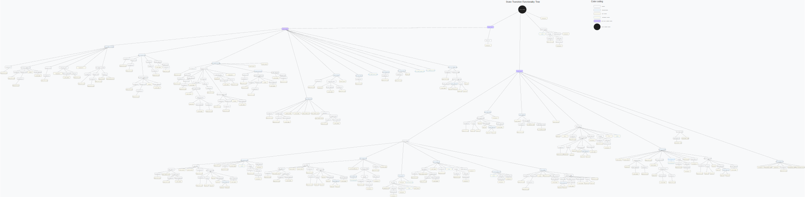

# State Transition Handbook

Before delving into the LECC state transition functions implementation, ensure you've covered the following:

- **Complete Reading**: Go through this entire document.
- **Relevant Documentation**: Familiarize yourself with related documentation. Relevant links are provided in the "References" section.
- **Comprehension**: Understand the mechanics and purpose of what you're about to implement. Ensure you can explain it to others.
- **Context**: Grasp why the implementation is necessary and its significance to the project.
- **Seek Clarifications**: If in doubt, don't hesitate to ask questions in the [Telegram group](https://t.me/lambdaconsensus).
- **Testing**: Ensure your implementation passes the relevant tests.
- **Optimization**: Strive for efficiency in your code.

## Introduction

The State Transition function lies at the heart of blockchains, driving their evolution. It transitions an initial state \( S0 \) into a subsequent state \( S1 \), as defined by:

$$S' = f(S, B)$$

Here, \( S' \) denotes the state after applying the State Transition function \( f \) to a State \( S \)  applying a Signed Beacon Block \( B \).

The Ethereum POS Beacon Chain has evolved its state transition function compared to its predecessor in Ethereum POW. Ethereum POW was **block-driven**, while the Beacon Chain is now **slot-driven**. This signifies that a state transition occurs every slot (currently every 12 seconds), irrespective of whether a block is received.

The Beacon Chain state transition function is composed of 3 core pieces: 
1. **slot processing**, performed for every slot (12 seconds).
2. **epoch processing**, performed every epoch (32 slots).
3. **block processing**, performed each time a block is received.

> [!IMPORTANT]  
> From the Eth2Book:
> Although the beacon chain's state transition is conceptually slot-driven, as the spec is written a state transition is triggered by receiving a block to process. That means that we first need to fast-forward from our current slot number in the state (which is the slot at which we last processed a block) to the slot of the block we are processing. We treat intervening slots, if any, as empty. This "fast-forward" is done by [`process_slots()`](https://eth2book.info/capella/part3/transition/#def_process_slots), which also triggers epoch processing as required.
> 
> In actual client implementations, state updates will usually be time-based, triggered by moving to the next slot if a block has not been received. However, the fast-forward functionality will be used when exploring different forks in the block tree.

The state transition part of a consensus client can be considered as black box, no other parts of the client need to be understood (thoroughly) to be able to make an implementation, furthermore it can be used as a standalone component.

## Decomposition

The goal through decomposition is to enable the thorough understanding of the inner workings of the function. Going through each argument and line one by one. To not get too much into the weeds we will only go 1 layer deep into the function.

### Declaration

The `state_transition` function is declared as follows:

```python
def state_transition(state: BeaconState, signed_block: SignedBeaconBlock, validate_result: bool=True) -> None:
    block = signed_block.message
    # Process slots (including those with no blocks) since block
    process_slots(state, block.slot)
    # Verify signature
    if validate_result:
        assert verify_block_signature(state, signed_block)
    # Process block
    process_block(state, block)
    # Verify state root
    if validate_result:
        assert block.state_root == hash_tree_root(state)
```

### Signature

| Parameter       | Type                 | Description                                 |
|-----------------|----------------------|---------------------------------------------|
| `state`         | `BeaconState`        | Describes the current state of the client.  |
| `signed_block`  | `SignedBeaconBlock`  | Represents the newly received block.        |
| `validate_result` | `boolean`          | If validation is required; default is true.     |
| Return Value    | `None`               | As it's a pure function, no value is returned. |

>[!IMPORTANT]
>In this example the return value is `None` because of the use of Python being an OOP language. Elixir being a functional language makes:
>1. data immutable
>2. mandatory for functions to return
>
>Hence here LECC would return a new updated `BeaconState`.

### Implementation 

- Extracting the block message from the `SignedBeaconBlock`:
  ```python
  block = signed_block.message
  ```

- Processing slots:
  ```python
  process_slots(state, block.slot)
  ```

- If `validate_result` is true, the block signature is verified:
  ```python
  assert verify_block_signature(state, signed_block)
  ```

- The block is then processed:
  ```python
  process_block(state, block)
  ```

- Lastly, if `validate_result` is true, the state root is verified:
  ```python
  assert block.state_root == hash_tree_root(state)
  ```

### Additional information

- The third core piece of the consensus layer state transition function is contained in the `process_slots` function. It's the `process_epoch` function. [See declaration](https://eth2book.info/capella/annotated-spec/#def_process_slots)

- The `SignedBeaconBlock` is a secure wrapper around the `BeaconBlock` container it is one of the two fundamental container of a consensus client with `BeaconState`. `BeaconBlock` is the  container used by the leader to communicate network updates to all other validators. `BeaconState` are the states of the chain kept internally by the clients, updated through the application of new `BeaconBlock`s. 

- The `validate_result` boolean can be turned to false when the client becomes a proposer (certain specific situations)

## Helper Functions

The `state_transition()` function, as the highest-order function, calls lower-order functions, which in turn utilize helper functions. These helper functions are categorized as:

### Predicates 

These functions verify specific conditions and return `true` or `false`. Typically, they start with `is_`. For example, `is_active_validator(validator, epoch)` verifies if a validator is active during a particular epoch.

```python
def is_active_validator(validator: Validator, epoch: Epoch) -> bool:
    """
    Check if ``validator`` is active.
    """
    return validator.activation_epoch <= epoch < validator.exit_epoch
```

### Accessors

Functions that access and compute data regarding the passed state. They do not perform any mutation. For instance, `get_current_epoch(state)` returns the current epoch.

```python
def get_current_epoch(state: BeaconState) -> Epoch:
    """
    Return the current epoch.
    """
    return compute_epoch_at_slot(state.slot)
```

### Mutators

Functions that modify the passed state. An example is `increase_balance(state, index, delta)`, which augments the balance of a specific validator.

```python
def increase_balance(state: BeaconState, index: ValidatorIndex, delta: Gwei) -> None:
    """
    Increase the validator balance at index ``index`` by ``delta``.
    """
    state.balances[index] += delta
```

### Miscellaneous

Other important functions assisting data computations, such as `compute_timestamp_at_slot(state, slot)`, which calculates the timestamp for a given slot.

```python
def compute_timestamp_at_slot(state: BeaconState, slot: Slot) -> uint64:
    slots_since_genesis = slot - GENESIS_SLOT
    return uint64(state.genesis_time + slots_since_genesis * SECONDS_PER_SLOT)
```

## Visual Function Tree

For a holistic view of the relationships and dependencies among all the state transition functions, refer to the provided visual representation:

> [!IMPORTANT]
> The Visual Function Tree is a crucial resource. Make sure to refer to it.

SVG version:


PNG version:


To explore the tree:
- Download the data Embedded SVG and open it with [Excalidraw](https://excalidraw.com/) for an interactive experience.
- Alternatively, download the PNG and zoom in for a detailed view.
- Alternatively, raw SVG usage enables text-search for quick discovery.

Furthermore the tree is accompanied by a legend enabling the correct understanding of the tree structure.

<div align="center">
    
</div>

## Testing

Most high-level state transition functions are accompanied by EF test vectors. Before submitting your implementation, ensure you pass these tests. 

The Visual Function Tree highlights which functions are testable. 

For a comprehensive understanding of testing your implementation, explore the [consensus tests documentation](https://github.com/ethereum/consensus-specs/tree/dev/tests/formats).

## References

Standing on the shoulders of giants is a prerequisite to innovation. Thank you to all the brilliant minds that contributed to this domain. This work draws inspiration and builds upon:
- [Eth2Book by Ben Edgington](https://eth2book.info)
- [Vitalik's Annotated Specifications](https://github.com/ethereum/annotated-spec)
- [Ethereum Consensus Layer Specs](https://github.com/ethereum/consensus-specs)
